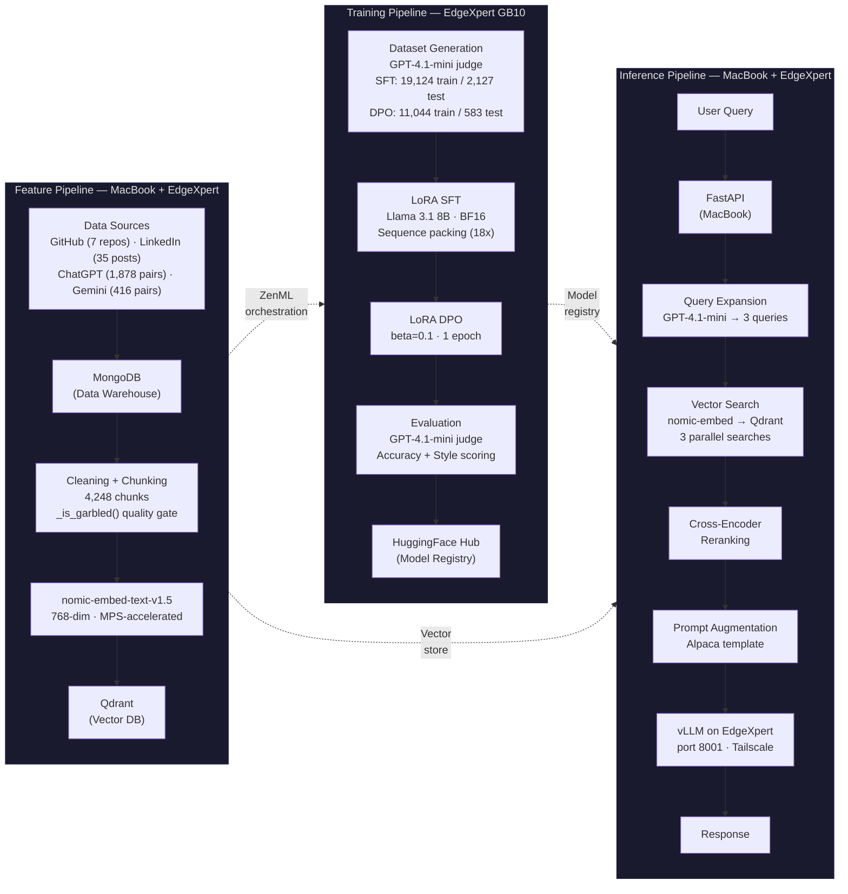

# LLM Twin — Production-Grade Personal LLM System

Fine-tuned Llama 3.1 8B on my own writing, reasoning patterns, and conversation history to generate content in my voice. End-to-end MLOps: data pipelines → LoRA SFT + DPO alignment → RAG inference — all trained and served locally on an NVIDIA GB10 Blackwell desktop (128GB unified memory). No cloud GPUs.


---

## Demo


Three queries showing the RAG inference pipeline: FastAPI receives a query on MacBook, expands it via GPT-4.1-mini, searches Qdrant, reranks with a cross-encoder, and generates a response through vLLM on EdgeXpert GB10 — all over Tailscale.

---

## Architecture

Three independently deployable pipelines following the [FTI (Feature/Training/Inference) architecture](https://www.hopsworks.ai/post/mlops-to-ml-systems-with-fti-pipelines):

- **Feature Pipeline** ingests data from 4 sources (GitHub repositories, LinkedIn posts, ChatGPT conversations, Gemini conversations), cleans it through a 4-check quality gate, chunks documents using category-aware strategies, embeds with nomic-embed-text-v1.5, and loads into Qdrant.
- **Training Pipeline** generates instruction and preference datasets using GPT-4.1-mini, fine-tunes Llama 3.1 8B via LoRA SFT and DPO on the GB10, evaluates with an LLM-as-a-Judge framework, and publishes to HuggingFace Hub.
- **Inference Pipeline** receives user queries via FastAPI, expands them into 3 semantic variants, searches Qdrant in parallel, reranks with a cross-encoder, augments the prompt using an Alpaca template, and generates responses via vLLM.

MacBook Pro M1 handles orchestration and CPU-bound work; EdgeXpert GB10 handles GPU-bound training and inference. Connected via Tailscale mesh VPN.



**Infrastructure Layout:**

| Component | Host | Purpose |
|-----------|------|---------|
| ZenML pipelines, FastAPI, feature engineering | MacBook Pro M1 | Orchestration, CPU/IO-bound work |
| MongoDB, Qdrant, training containers, vLLM | EdgeXpert GB10 (128GB) | GPU-bound training + inference |
| Tailscale mesh VPN | Both | Secure connectivity without port forwarding |

---

## Key Results

| Metric | Value |
|--------|-------|
| SFT Style Score | 2.78 / 3.0 |
| SFT Accuracy Score | 2.37 / 3.0 |
| Instruct Baseline Style | 2.21 / 3.0 (SFT improved by +26%) |
| Training Time (SFT) | 1h 30m on GB10 Blackwell |
| Training Data | 19,124 SFT samples, 11,044 DPO preference pairs |
| Vector Store | 4,248 embedded chunks across 4 data sources |
| Inference | vLLM serving via OpenAI-compatible API |

DPO alignment was attempted but did not improve over SFT due to style saturation — SFT had already captured 93% of the target style score, leaving no headroom for preference optimization. The SFT model is deployed. This is documented as a real finding, not a failure — knowing when a technique doesn't help is as important as knowing when it does.

### Trained Models

All models are published on HuggingFace under [`kwisschen`](https://huggingface.co/kwisschen):

| Model | Type | HuggingFace | Status |
|-------|------|-------------|--------|
| TwinLlama-3.1-8B | LoRA SFT adapter | [`kwisschen/TwinLlama-3.1-8B`](https://huggingface.co/kwisschen/TwinLlama-3.1-8B) | **Deployed** |
| TwinLlama-3.1-8B-Merged | SFT merged 16-bit | [`kwisschen/TwinLlama-3.1-8B-Merged`](https://huggingface.co/kwisschen/TwinLlama-3.1-8B-Merged) | **Serving via vLLM** |
| TwinLlama-3.1-8B-DPO | LoRA DPO adapter | [`kwisschen/TwinLlama-3.1-8B-DPO`](https://huggingface.co/kwisschen/TwinLlama-3.1-8B-DPO) | Archived |
| TwinLlama-3.1-8B-DPO-Merged | DPO merged 16-bit | [`kwisschen/TwinLlama-3.1-8B-DPO-Merged`](https://huggingface.co/kwisschen/TwinLlama-3.1-8B-DPO-Merged) | Archived |

### DPO Analysis

Initial DPO training used beta=0.5, which degraded both accuracy (-0.32) and style (-0.31) compared to the SFT baseline. Diagnosis: SFT had already achieved 2.78/3.0 on style, leaving minimal headroom for DPO improvement. Beta=0.5 over-constrained the policy near a local optimum slightly worse than SFT.

Reducing beta to 0.1 (standard default) recovered accuracy from 2.05 to 2.31 and style from 2.47 to 2.74. DPO still performed slightly below SFT on both metrics, confirming the style saturation hypothesis. The SFT adapter and DPO adapter are both published for reproducibility; the SFT model is what serves inference.

### Data Sources

All training data is from Christopher's own writing and conversations — data provenance is validated before training, not after. This was a critical lesson: the original pipeline included 76 articles from the book authors, which would have trained the model to mimic someone else's voice.

| Source | Type | Volume | Chunking Strategy |
|--------|------|--------|-------------------|
| GitHub | 7 repositories | 4,248 chunks total | Per-file: split on `####` file separator, then token-based chunking within each file |
| LinkedIn | 35 posts | — | Direct text extraction |
| ChatGPT | 68 conversations → 1,878 pairs | — | Atomic: one chunk per Q&A pair (multi-turn expanded into discrete pairs) |
| Gemini | 416 conversation pairs | — | Atomic: same strategy as ChatGPT |

The feature engineering pipeline applies category-aware preprocessing: conversations skip sentence-splitting (already atomic Q&A pairs, 200-char floor), while repository and post content uses token-based splitting (1,000-char floor). A `_is_garbled()` quality gate rejects corrupted content at the preprocessing boundary — garbled data that passes through fine-tuning produces models that memorize noise without any signal in loss curves.

### Evaluation Methodology

Evaluation uses GPT-4.1-mini as an LLM-as-a-Judge, scoring each model output on two independent criteria (1–3 scale):

- **Accuracy** (safety check): Did the fine-tuned model retain factual knowledge? Validates that LoRA training did not catastrophically degrade the base model.
- **Style** (success metric): Does the output match Christopher's informal, blog-appropriate writing voice? This is the actual optimization target.

Two dimensions prevent a single aggregate score from hiding tradeoffs. The judge model is from a different model family (OpenAI judging Llama), avoiding family bias. JSON structured output mode ensures reliable score parsing across 6,400+ evaluations at ~$3 total cost. Results are tracked in Comet ML with Opik tracing for end-to-end prompt visibility.

A post-training quality gate generates 10 sample outputs for manual review before proceeding to any next stage. This gate was added after a merged model corruption incident that produced garbage outputs undetectable by loss curves — the quality gate would have caught it in 5 minutes instead of days.

---

## Design Decisions

Each entry describes a constraint, a decision, and a tradeoff. For the full list of 38 decisions, see [`architectural-decisions.md`](architectural-decisions.md).

<details>
<summary><strong>LoRA over QLoRA</strong></summary>

The EdgeXpert GB10 has 128GB unified memory — enough to run full BF16 LoRA without quantization. QLoRA introduces quantization noise during the forward pass that degrades fine-tuning quality. On a cloud GPU with 24GB VRAM (e.g., A10G on SageMaker), QLoRA would be the only option. With 128GB available, quantization is an unnecessary quality tradeoff. Match compute to quality constraint.
</details>

<details>
<summary><strong>Self-hosted GB10 over cloud GPUs</strong></summary>

Full control over the container lifecycle, no cold-start latency, no per-hour billing during iterative development. The tradeoff is real: managing Docker containers, GPU handle staleness after power cycles, manual container recreation, and Triton kernel compatibility on Blackwell. For a project with dozens of training iterations over weeks, the amortized cost and iteration speed justify the ops burden.
</details>

<details>
<summary><strong>Separate training and serving containers</strong></summary>

vLLM bundles its own PyTorch build (compiled against CUDA 12 library paths) which silently overwrites NGC's custom PyTorch (CUDA 13.x) when installed in the same container. This was discovered during evaluation when model outputs degraded — the training environment was corrupted. Permanent policy: training (`llm-training-ready-v2`, NGC base) and serving (`vllm/vllm-openai`) containers never share an image.
</details>

<details>
<summary><strong>SFT deployed over DPO</strong></summary>

DPO with beta=0.1 recovered to within noise of SFT, but SFT already saturated the style dimension at 2.78/3.0. Initial DPO with beta=0.5 actually degraded both accuracy (-0.32) and style (-0.31). Reducing beta to 0.1 recovered performance but could not exceed SFT. Ship the model that scores best on the actual success metric.
</details>

<details>
<summary><strong>Microservices split: CPU on MacBook, GPU on EdgeXpert</strong></summary>

Retrieval is CPU/IO-bound: OpenAI API calls for query expansion, Qdrant vector search, cross-encoder reranking. Generation is GPU-bound. Running both on the GB10 wastes GPU cycles on network IO. FastAPI handles retrieval on MacBook; vLLM handles generation on EdgeXpert. Tailscale mesh connects them. Same pattern as the handbook's SageMaker + FastAPI split, adapted for self-hosted infrastructure.
</details>

<details>
<summary><strong>4-check data quality gate</strong></summary>

`_is_garbled()` checks four dimensions: non-ASCII ratio (threshold 0.15), whitespace density, 4-gram repetition dominance, and Shannon entropy bounds (1.5–5.8 bits/char). Category-aware: code files skip the whitespace check and use a raised entropy ceiling (6.2 bits/char). This caught dataset contamination that loss curves could not detect — garbled content passes through fine-tuning and produces models that memorize noise.
</details>

<details>
<summary><strong>Sequence packing for SFT</strong></summary>

19,124 samples compressed into 1,044 packed sequences by concatenating short samples into 2048-token windows. 18x step reduction with identical data coverage. DPO cannot use packing because it processes prompt/chosen/rejected as aligned triples — packing would break the alignment required for log probability difference computation.
</details>

<details>
<summary><strong>Prompt template alignment (Alpaca format)</strong></summary>

Inference prompt must exactly match the SFT training template. Mismatched templates produce garbage. Initial testing with a vague system instruction caused meta-commentary (model described what it would write instead of writing it). Fixed by using a directive persona framing within the Alpaca template structure.
</details>

---

## Tech Stack

| Layer | Tool | Role |
|-------|------|------|
| Orchestration | ZenML | Pipeline DAGs, artifact tracking, cache management |
| Experiment Tracking | Comet ML | Loss curves, hyperparameters, model comparison |
| LLM Tracing | Opik | End-to-end trace logging for RAG pipeline |
| Data Warehouse | MongoDB | Raw documents (GitHub, LinkedIn, ChatGPT, Gemini) |
| Vector DB | Qdrant | Embedded chunks for retrieval |
| Embeddings | nomic-embed-text-v1.5 | 768-dim, MPS-accelerated on M1 |
| Fine-tuning | Unsloth + TRL | LoRA SFT + DPO on Llama 3.1 8B |
| Inference | vLLM | OpenAI-compatible API, continuous batching, PagedAttention |
| API Layer | FastAPI | Business microservice (retrieval + prompt augmentation) |
| Model Registry | HuggingFace Hub | Adapters + merged models ([kwisschen](https://huggingface.co/kwisschen)) |
| Networking | Tailscale | Mesh VPN connecting MacBook ↔ EdgeXpert |
| Hardware | NVIDIA GB10 Blackwell | 128GB unified memory, training + inference |

---

## Project Structure

```
├── llm_engineering/                # Core package — DDD layers
│   ├── application/                # Application layer (crawlers, RAG, dataset generation)
│   ├── domain/                     # Domain entities (documents, chunks, queries)
│   ├── infrastructure/             # Infrastructure adapters (MongoDB ODM, AWS)
│   ├── model/                      # Inference module (vLLM client, prompt templates)
│   └── settings.py                 # Environment-driven configuration (Pydantic)
├── steps/                          # ZenML step definitions
│   ├── etl/                        # Data ingestion steps
│   ├── feature_engineering/        # Chunking, embedding, vector DB loading
│   ├── generate_datasets/          # Instruct + preference dataset generation
│   ├── evaluating/                 # LLM-as-Judge evaluation steps
│   └── training/                   # Training pipeline steps
├── pipelines/                      # ZenML pipeline definitions
│   ├── feature_engineering.py
│   ├── generate_datasets.py
│   ├── evaluating.py
│   └── training.py
├── scripts/
│   ├── training/                   # Training scripts, ops guides, results
│   ├── evaluation/                 # Evaluation scripts (generate + judge)
│   └── inference/                  # Quality validation results
├── tools/                          # CLI entry points (poe tasks route here)
│   ├── run.py                      # Main CLI dispatcher
│   ├── ml_service.py               # FastAPI inference service
│   ├── rag.py                      # Retrieval module standalone test
│   └── data_warehouse.py           # Import/export utilities
├── configs/                        # Pipeline and ETL configuration YAML files
├── tests/                          # Pytest suite (unit + integration)
├── docs/                           # Documentation
├── pyproject.toml                  # Poetry dependencies + Poe the Poet tasks
├── verify_db.py                    # MongoDB + Qdrant connectivity check
├── docker-compose.yml              # Local infrastructure (MongoDB, Qdrant, ZenML)
└── .env.example                    # Template for required environment variables
```

> **Note:** `llm_engineering/` follows Domain-Driven Design — `domain` defines entities, `application` contains business logic, `infrastructure` handles external systems. The `Dispatcher` pattern routes processing by `DataCategory` (posts, articles, repositories, conversations).
>
> This tree is representative. Run `tree -L 2 -I '__pycache__|*.pyc|.git'` on the repo for the exact current structure.

---

## Getting Started

### Prerequisites

- Python 3.11
- [Poetry](https://python-poetry.org/) (with [Poe the Poet](https://poethepoet.naber.io/) plugin)
- Docker (for MongoDB and Qdrant, or self-hosted GPU server)
- MongoDB instance
- Qdrant instance
- GPU server accessible via network (for vLLM inference)

### Installation

```bash
git clone https://github.com/kwisschen/LLM-Twin.git
cd LLM-Twin
poetry install --without aws
poetry self add 'poethepoet[poetry_plugin]'
```

### Environment Setup

Copy `.env.example` to `.env` and fill in the required values:

| Variable | Service | Purpose |
|----------|---------|---------|
| `OPENAI_API_KEY` | OpenAI | Query expansion (GPT-4.1-mini), dataset generation, evaluation |
| `HUGGINGFACE_ACCESS_TOKEN` | HuggingFace | Model registry access |
| `COMET_API_KEY` | Comet ML | Experiment tracking |
| `DATABASE_HOST` | MongoDB | Data warehouse connection |
| `QDRANT_DATABASE_HOST` | Qdrant | Vector DB connection |

All configuration is environment-driven via `llm_engineering/settings.py`. No hardcoded credentials.

### Verify Infrastructure

```bash
poetry poe verify-db
```

### Run Inference Demo

```bash
# Start the FastAPI service (MacBook)
poetry poe run-inference-ml-service

# In another terminal — test a query
curl -X POST 'http://127.0.0.1:8000/rag' \
  -H 'Content-Type: application/json' \
  -d '{"query": "Could you draft a LinkedIn post discussing RAG systems?"}'
```

> **Note:** Inference requires a running vLLM instance on the GPU server. See [`scripts/training/edgexpert-training-ops.md`](scripts/training/edgexpert-training-ops.md) for container setup and lifecycle management.

### Pipeline Commands

All pipelines are exposed via [Poe the Poet](https://poethepoet.naber.io/) tasks defined in `pyproject.toml`:

```bash
# Data pipelines
poetry poe run-feature-engineering-pipeline          # ETL → clean → chunk → embed → Qdrant
poetry poe run-generate-instruct-datasets-pipeline   # Generate SFT instruction pairs
poetry poe run-generate-preference-datasets-pipeline # Generate DPO preference triples

# Training and evaluation (requires GPU server)
poetry poe run-training-pipeline
poetry poe run-evaluation-pipeline

# Inference
poetry poe run-inference-ml-service    # Start FastAPI server
poetry poe call-rag-retrieval-module   # Test retrieval module standalone

# Infrastructure
poetry poe verify-db                   # Confirm MongoDB + Qdrant connectivity
```

> **Cache invalidation:** All pipeline commands include `--no-cache` by default. ZenML's cache can silently serve stale artifacts when upstream data changes — this was discovered when a garbled dataset survived through cache into SFT training.

### GPU Server Setup

Training and inference run on the EdgeXpert GB10 via Docker containers. Key operational details:

1. **Training container** (`llm-training-ready-v2`): NGC PyTorch base image with Unsloth, TRL, and Comet ML pre-installed. Must be recreated (not restarted) after host power cycles due to GPU handle staleness.
2. **Inference container** (`vllm/vllm-openai`): Official vLLM image serving the fine-tuned model on port 8001. Safe to `docker start` after container stops (no baked-in packages to corrupt).
3. **Permanent policy:** Training and serving containers are never combined. See [Design Decisions → Separate training and serving containers](#design-decisions).

Full container lifecycle documentation: [`scripts/training/edgexpert-training-ops.md`](scripts/training/edgexpert-training-ops.md)

### Pre-Run Verification (Training)

Three mandatory verification layers before every training launch:

| Layer | What it catches | Example |
|-------|----------------|---------|
| **Import checks** | Missing packages, broken installs | `ModuleNotFoundError: No module named 'unsloth'` |
| **API signature inspection** | Parameter renames across library versions | `beta` silently ignored in DPOTrainer (moved to DPOConfig) |
| **Trainer smoke test** | Runtime attribute errors from cross-package mismatches | `AttributeError: 'PeftModelForCausalLM' has no attribute 'warnings_issued'` |

The smoke test was added after a bug that passed layers 1 and 2 but crashed at trainer instantiation. Details in [`scripts/training/edgexpert-training-ops.md`](scripts/training/edgexpert-training-ops.md).

---

## Roadmap

- [x] Data pipelines (GitHub, LinkedIn, ChatGPT, Gemini ETL with quality gates)
- [x] Feature engineering + vector store (4,248 chunks in Qdrant)
- [x] LoRA SFT + DPO fine-tuning on GB10 Blackwell
- [x] Evaluation framework (GPT-4.1-mini judge, accuracy + style scoring)
- [x] RAG inference pipeline (FastAPI + vLLM microservices)
- [x] Live demo (terminal recording of RAG inference pipeline)
- [ ] Opik tracing for inference pipeline (evaluation tracing complete, RAG pipeline tracing pending)
- [ ] **Agentic Patent Analyst** — autonomous multi-step prior art research agent. LangGraph orchestration, Google Patents API via Serper.dev, Qwen 2.5-32B reasoning on self-hosted GPU. Domain evaluation by practicing patent professional. *Separate repository — link coming soon.*


---

## Credits

This project builds on the codebase from [*LLM Engineers Handbook*](https://github.com/PacktPublishing/LLM-Engineers-Handbook) by Paul Iusztin and Maxime Labonne (Packt, 2024). The book provided the foundational architecture (FTI pipelines, DDD domain model, ZenML orchestration).

My contributions include: custom ETL pipelines for personal data sources (ChatGPT, Gemini, LinkedIn, GitHub), a 4-check data quality system, deployment on self-hosted NVIDIA GB10 Blackwell hardware (replacing the book's AWS SageMaker approach), DPO alignment training with style saturation analysis, and a hybrid-infrastructure RAG inference pipeline over Tailscale.

---

## About

**Christopher Chen** — ML / AI Engineer building production LLM systems on self-hosted infrastructure. 10 years in patent engineering — cross-language specification review (EN/CN/JP), workflow automation, and digital transformation. Harvard University ALM candidate (expected 2026).

[LinkedIn](https://www.linkedin.com/in/kwisschen/) · [HuggingFace](https://huggingface.co/kwisschen) · [Blog](#)

---

## License

This project is licensed under the MIT License. See the original [LLM Engineers Handbook repository](https://github.com/PacktPublishing/LLM-Engineers-Handbook) for the upstream license.

<!-- end -->

